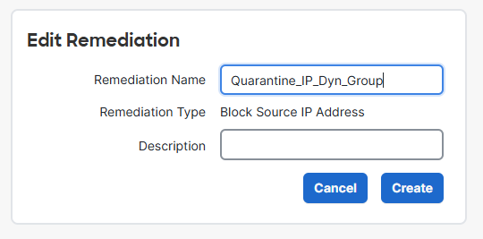

# fmc-remediation-module-dyn-obj

[](https://developer.cisco.com/codeexchange/github/repo/vagner-instructor/fmc-remediation-module-fmc-dyn-obj)

# Cisco FMC Remediation Module for FMC Dynamic Object

The FMC Remediation Module for FMC Dynamic Object in this repository sends an IP Address from any Correlation Rule to a dynamic object in FMC.
The Dynamic Object does not need deploy, so it can be pushed automatically to Secure Firewall.
The following products are being used:

- Cisco Secure Firewall
- Cisco Secure Firewall Management

This repository shows a simple example of a remediation module that can be installed in Cisco
Firepower Management Center (FMC). When adverse conditions in a customer's network violate an FMC
correlation policy, this module can trigger an automation response and add an ip address for a specific time in seconds 
in a dynamic network group which can be used in a Firewall rule to be blocked during this specific time.


This repository contains a small python code [example workflow](./module/fmc_quarantine_ip.py). The python
receives the source ip address, input data through FMC api in a Dynamic Group, it waits for N seconds and then remove it.
This will blocks the offending source IP in Cisco Secure Firewall automatically, therefore also blocking any newer 
attack attempts by that source IP for N seconds.

## Installation

Clone the repo
```bash
git clone https://github.com/vagner-instructor/fmc-remediation-module-fmc-dyn-obj.git
```

Go to your project folder
```bash
cd fmc-remediation-module-fmc-dyn-obj
```

Create the remediation module package
```bash
tar -C module -czf fmc_dyn_obj_remediation_module.tar.gz module.template fmc_quarantine_ip.py
```

### Install the package as a remediation module in FMC.

1. Navigate to **Polices -> Actions -> Modules**.


2. Click on **Choose File** and select the
`fmc_dyn_obj_remediation_module.tar.gz` file generated from the previous command.


3. Once installed, click on the  icon next to
the module to view the details.


## Configuration

### Pre-requisites

Secure Firewall Management API username and password
Secure Firewall Management IP address
Time needed in seconds
A Dynamic Group already created in FMC


```
restapiuser
C1sco12345
198.18.133.50
SOC-Block-List-IP
```

### Create a new remediation instance in FMC.

1. On the remediation module details screen, click on the **Add** button under
**Configured Instances**. Provide a name, description, Firewall details and **Time of Quarantine** in seconds for the
instance and click on **Create**.


2. Click on the **Add** button to add a remediation action of one of the types available from the
dropdown.


3. Provide a name and description for the remediation action and click on **Create** and then
**Save**.




## Usage

Navigate to **Policies -> Correlation**.

### Create a correlation rule

1. Navigate to the **Rule Management** tab and click on **Create Rule** button. Provide necessary
details for the rule and click **Save**.


### Create a correlation policy

1. Navigate to the **Policy Management** tab and click on **Create Policy**. Provide necessary details
for the policy.

2. Click on **Add Rules**. Select the newly added rule. Click on the **Add** button.

3. Click on  next to the rule. Select the newly created
remediation action. Move it to **Assigned Responses** and save the changes.


3. Activate the poilcy.

## How to test the remediation module

Generate events that trigger the correlation policy.

### Testing the module from the FMC CLI.

```
[vagner@linux-outside ~]$ ssh admin@LAB-FMC76.example.org
Password:

Copyright 2004-2024, Cisco and/or its affiliates. All rights reserved.
Cisco is a registered trademark of Cisco Systems, Inc.
All other trademarks are property of their respective owners.

Cisco Firepower Extensible Operating System (FX-OS) v2.16.0 (build 128)
Cisco Secure Firewall Management Center for VMware v7.6.0 (build 113)

>
>
> expert
admin@LAB-FMC76:~$
admin@LAB-FMC76:~$ cd /var/sf/remediations/
admin@LAB-FMC76:/var/sf/remediations$
admin@LAB-FMC76:/var/sf/remediations$ ls -l
total 24
drwxr-s--- 2 www sfremediation 4096 Jul  2 18:35 NMap_perl_2.0
drwxr-s--- 2 www sfremediation 4096 Jul  2 18:35 SetAttrib_1.0
drwxr-s--- 2 www sfremediation 4096 Jul  8 15:11 TriggerFMCDynamicObject_1.0
drwxr-s--- 2 www sfremediation 4096 Jul  2 18:35 cisco_ios_router_1.0
drwxr-s--- 2 www sfremediation 4096 Jul  2 18:35 cisco_pxgrid_1.0
drwxr-s--- 2 www sfremediation 4096 Jul  2 18:35 cisco_pxgrid_anc_1.0
admin@LAB-FMC76:/var/sf/remediations$
admin@LAB-FMC76:/var/sf/remediations$ sudo -i

We trust you have received the usual lecture from the local System
Administrator. It usually boils down to these three things:

    #1) Respect the privacy of others.
    #2) Think before you type.
    #3) With great power comes great responsibility.

Password:
root@LAB-FMC76:~#
root@LAB-FMC76:~#
root@LAB-FMC76:~# cd /var/sf/remediations/
root@LAB-FMC76:/var/sf/remediations#
root@LAB-FMC76:/var/sf/remediations# ls -l TriggerFMCDynamicObject_1.0/
total 12
drwxrwsr-x 2 root sfremediation  4096 Nov 25 02:07 Quarantine_IP_Dyn_Group
-r-xr-x--- 1 www  sfremediation 12555 Nov 26 10:31 fmc_quarantine_ip.py
-r-xr-x--- 1 www  sfremediation  2040 Nov 25 02:03 module.template
root@LAB-FMC76:/var/sf/remediations#
root@LAB-FMC76:/var/sf/remediations# cd TriggerFMCDynamicObject_1.0/
root@LAB-FMC76:/var/sf/remediations/TriggerFMCDynamicObject_1.0#
root@LAB-FMC76:/var/sf/remediations/TriggerFMCDynamicObject_1.0# ls -l
total 12
drwxrwsr-x 2 root sfremediation 4096 Nov 11 00:31 Quarantine_IP_Dyn_Group
-r-xr-x--- 1 www  sfremediation 2204 Nov 10 17:49 fmc_quarantine_ip.py
-r-xr-x--- 1 www  sfremediation 1820 Nov 10 16:57 module.template
root@LAB-FMC76:/var/sf/remediations/TriggerFMCDynamicObject_1.0#
root@LAB-FMC76:/var/sf/remediations/TriggerFMCDynamicObject_1.0# ls -l Quarantine_IP_Dyn_Group/
total 4
-rw-r--r-- 1 www sfremediation 541 Nov 11 00:35 instance.conf
root@LAB-FMC76:/var/sf/remediations/TriggerFMCDynamicObject_1.0#
root@LAB-FMC76:/var/sf/remediations/TriggerFMCDynamicObject_1.0# cd Quarantine_IP_Dyn_Group/
root@LAB-FMC76:/var/sf/remediations/TriggerFMCDynamicObject_1.0/Quarantine_IP_Dyn_Group#
root@LAB-FMC76:/var/sf/remediations/TriggerFMCDynamicObject_1.0/Quarantine_IP_Dyn_Group# cat instance.conf
<?xml version='1.0' encoding='utf-8'?>
<instance name="Quarantine_IP_Dyn_Group">
  <config>
    <ipaddress name="fmc_ip">198.18.134.120</ipaddress>
    <string name="fmc_user">restapiuser</string>
    <string name="fmc_password">C1sco12345</string>
    <string name="fmc_dyn_object_name">SOC-OBJECT-BLOCK-LIST</string>
    <string name="quarantine_time">150</string>
    <string name="firewall_obs" />
    <string name="auth_token">b022de8c-3a73-404c-ba6a-a09d27dded64</string>
    <string name="domain_uuid">e276abec-e0f2-11e3-8169-6d9ed49b625f</string>
    <string name="last_updated">2024-11-26 10:20:18</string>
  </config>
  <remediation name="Quarantine_Source_IP" type="block_source">
    <config>
    </config>
  </remediation>

root@LAB-FMC76:/var/sf/remediations/TriggerFMCDynamicObject_1.0/Quarantine_IP_Dyn_Group#
root@LAB-FMC76:/var/sf/remediations/TriggerFMCDynamicObject_1.0/Quarantine_IP_Dyn_Group# python3 ../fmc_quarantine_ip.py Quarantine_IP_Dyn_Object 10.6.6.6

Token: 57ab085a-c9e0-4b52-9dd9-3c815daf03a5
Domain UUID: e276abec-e0f2-11e3-8169-6d9ed49b625f
Successfully updated instance.conf with auth_token, domain_uuid, and timestamp.

Generating Token and Connecting

Fetching Dynamic Object ID...

Dynamic Object ID: 00505697-87B7-0ed3-0000-442381635169

Updating Dynamic Object with IP: 10.6.6.6...

Successfully added IP address 10.6.6.6 to dynamic object.

Waiting for 150 seconds...


Removing IP: 10.6.6.6 from Dynamic Object...

Successfully removed IP address 10.6.6.6 from dynamic object.

root@LAB-FMC76:/var/sf/remediations/TriggerFMCDynamicObject_1.0/Quarantine_IP#
```

Note if you run again, or run multiple paralel requests it will use an existing token from instance.conf .
We're doing that to resolve expired token issue

```
root@LAB-FMC76:/var/sf/remediations/TriggerFMCDynamicObject_1.0/Quarantine_IP_Dyn_Group# python3 ../fmc_quarantine_ip.py Quarantine_IP_Dyn_Object 10.7.7.7
Using existing token from instance.conf.

Fetching Dynamic Object ID...

Dynamic Object ID: 00505697-87B7-0ed3-0000-442381635169

Updating Dynamic Object with IP: 10.7.7.7...

Successfully added IP address 10.7.7.7 to dynamic object.

Waiting for 150 seconds...


Removing IP: 10.7.7.7 from Dynamic Object...

Successfully removed IP address 10.7.7.7 from dynamic object.
```

## References

* [Remediation Module - Cisco Secure Workflow](https://www.cisco.com/c/en/us/td/docs/security/firepower/tetration/quick-start/guide/fmc-rm-sw-qsg.html)
* [FMC 7.0 Configuration Guide - Correlation Policies](https://www.cisco.com/c/en/us/td/docs/security/firepower/70/configuration/guide/fpmc-config-guide-v70/correlation_policies.html)
* [Cisco FMC Remediation Module for XDR by Chetankumar Phulpagare and Mackenzie Myers](https://github.com/chetanph/fmc-remediation-module-xdr/tree/main)


### DevNet Sandbox

https://devnetsandbox.cisco.com/DevNet/catalog/firepower-mgmt-center

## Caveats

Please note that the module provided in this repository is a sample module.
Although it provides a minimum viable module that provides the functionality as described above,
it is not ready for use in a production network.

Additional development would be required to meet necessary functional and non-functional
requirements for any customer environment before the module can be used in a production network.

## Getting help

If you have questions, concerns, bug reports, vulnerability, etc., please create an issue against this repository.

## Author(s)

This project was written and is maintained by the following individual(s):

* Vagner Silva

## OpenSSF Best Practices
[](https://www.bestpractices.dev/projects/9715)


## Credit(s)

* Chetankumar Phulpagare
* Mackenzie Myers
